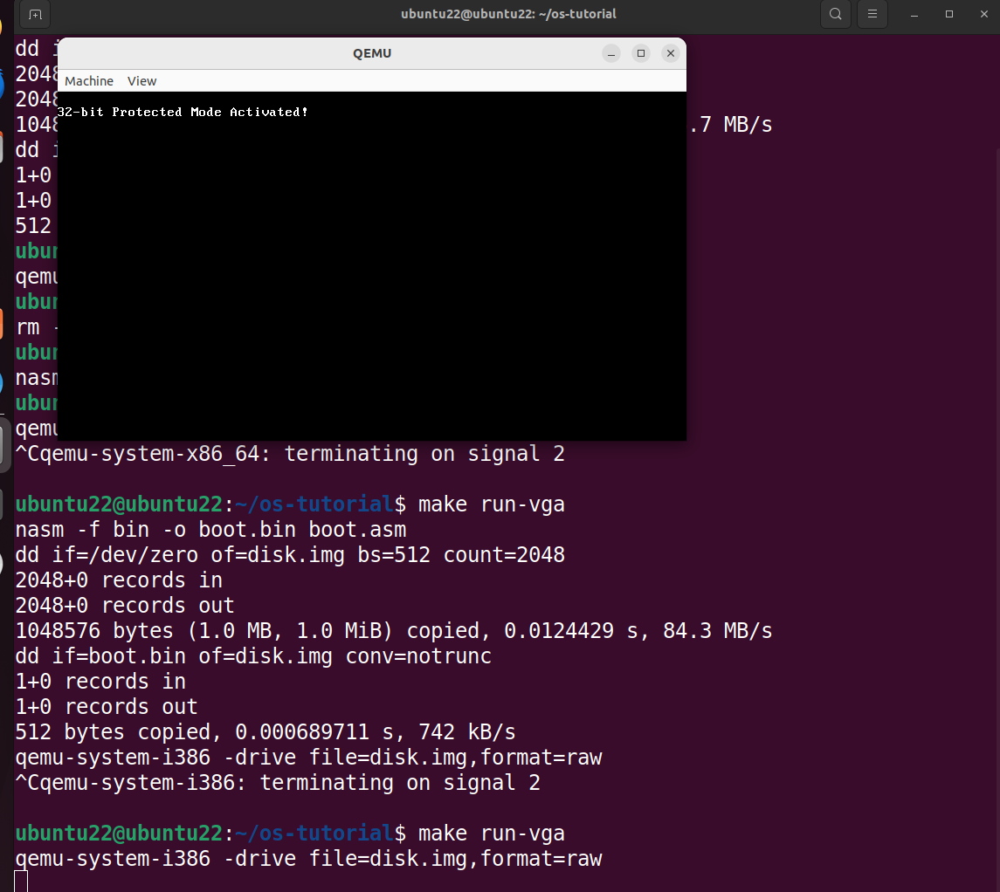

# 从零开始制作 MyOS（三）—— 切换保护模式

## 目标

今天的目标是从实模式切换到保护模式

## 保护模式切换流程

1. 设置GDT (lgdt)
2. 启用A20地址线
3. 设置CR0.PE标志
4. 远跳转刷新流水线
5. 初始化保护模式段寄存器

## 关键组件解析

1. GDT 设置

+ gdt_start​：定义全局描述符表
    + 空描述符（必须存在）
    + 代码段描述符（可执行、只读）
    + 数据段描述符（可读写）
+ gdt_descriptor​：包含GDT大小和基地址

2. 内存布局

+ 0x7C00-0x7DFF：引导扇区
+ 0x10000：内核加载位置（64KB处）
+ 0x90000：保护模式栈指针


4. 关键寄存器作用​：

​+ CR0​：控制寄存器，PE位控制保护模式
+ ​GDTR​：存储GDT的基址和界限
​+ 段寄存器​：在保护模式下变为段选择子

## 代码

```
; boot.asm - BIOS boot sector with protected mode switch
org 0x7C00       ; BIOS加载引导扇区到内存0x7C00处
bits 16          ; 16位实模式代码

start:
    ; === 初始化环境 ===
    cli         ; 禁用中断(防止设置过程中被中断)
    xor ax, ax  ; AX清零(比mov ax,0更高效)
    mov ds, ax  ; 数据段寄存器DS=0
    mov es, ax  ; 额外段寄存器ES=0
    mov ss, ax  ; 堆栈段寄存器SS=0
    mov sp, 0x7C00 ; 栈指针SP=0x7C00(向下增长)
    sti         ; 启用中断

    ; === 显示加载信息 ===
    mov si, loading_msg
    call print_string

    ; === 加载磁盘内容 ===
    call load_disk
    jc disk_error  ; 如果出错跳转到错误处理

    ; === 显示加载成功信息 ===
    mov si, loading_disk_success
    call print_string

    ; === 准备保护模式 ===
    call setup_gdt    ; 设置全局描述符表(GDT)
    call enable_a20    ; 启用A20地址线
    call switch_to_pm  ; 切换到保护模式

    ; === 永远不会执行到这里 ===
    jmp $

;============= 磁盘加载函数 =============
load_disk:
    ; 参数:
    ;   dl = 驱动器号 (0x80=第一硬盘)
    ;   dh = 磁头号
    ;   ch = 柱面号
    ;   cl = 起始扇区号(1-based)
    ;   al = 要读取的扇区数
    ;   es:bx = 目标缓冲区地址
    ; 返回:
    ;   CF = 1表示出错
    
    mov dl, 0x80    ; 驱动器号(0x80=第一硬盘)
    mov dh, 0       ; 磁头号
    mov ch, 0       ; 柱面号
    mov cl, 2       ; 起始扇区号(1-based)
    mov al, 8       ; 要读取的扇区数(8*512=4KB)
    mov bx, 0x8000  ; 目标偏移地址
    mov es, bx      ; ES:BX = 0x8000:0x0000
    xor bx, bx      ; BX清零
    
    mov ah, 0x02    ; BIOS读扇区功能号
    int 0x13        ; 调用BIOS磁盘服务
    
    ; === 错误重试机制(最多3次) ===
    mov byte [retry_count], 3
.retry:
    jnc .success    ; 成功则跳转
    
    ; === 重置磁盘控制器 ===
    pusha
    xor ah, ah      ; 功能号0=重置磁盘
    int 0x13
    popa
    
    dec byte [retry_count]
    jz .failure     ; 重试次数用完
    
    ; === 重新尝试读取 ===
    int 0x13
    jmp .retry

.success:
    ret             ; 成功返回

.failure:
    stc             ; 设置进位标志表示错误
    ret             ; 返回

;============= 保护模式设置 =============
setup_gdt:
    ; 加载GDT描述符到GDTR寄存器
    lgdt [gdt_descriptor]
    ret

enable_a20:
    ; === 通过键盘控制器启用A20地址线 ===
    ; 步骤1: 发送禁用键盘命令
    call .wait_kbd
    mov al, 0xAD
    out 0x64, al
    
    ; 步骤2: 发送读取输出端口命令
    call .wait_kbd
    mov al, 0xD0
    out 0x64, al
    
    ; 步骤3: 读取输出端口值
    call .wait_kbd
    in al, 0x60
    push ax          ; 保存原始值
    
    ; 步骤4: 发送写入输出端口命令
    call .wait_kbd
    mov al, 0xD1
    out 0x64, al
    
    ; 步骤5: 写回输出端口值(启用A20)
    call .wait_kbd
    pop ax
    or al, 2         ; 设置A20使能位
    out 0x60, al
    
    ret

.wait_kbd:
    ; 等待键盘控制器就绪
    in al, 0x64
    test al, 0x02    ; 检查输入缓冲区状态
    jnz .wait_kbd    ; 缓冲区不为空则继续等待
    ret

switch_to_pm:
    ; === 切换到保护模式 ===
    cli              ; 禁用中断
    mov eax, cr0     ; 加载控制寄存器
    or eax, 0x1      ; 设置PE(保护模式使能)位
    mov cr0, eax     ; 写回控制寄存器
    
    ; 远跳转刷新流水线并加载CS段选择子
    jmp CODE_SEG:init_pm

;============= 32位保护模式代码 =============
bits 32
init_pm:
    ; === 初始化保护模式段寄存器 ===
    mov ax, DATA_SEG
    mov ds, ax
    mov es, ax
    mov fs, ax
    mov gs, ax
    mov ss, ax
    mov esp, 0x90000 ; 设置32位栈指针
    
    ; === 清屏 ===
    mov edi, 0xB8000 ; VGA文本缓冲区基址
    mov ecx, 80*25   ; 80列25行
    mov ax, 0x0F20   ; 黑底白字的空格
.clear:
    stosw             ; 写入显存
    loop .clear
    
    ; === 显示保护模式激活信息 ===
    mov edi, 0xB8000 + 160 ; 第二行开始显示
    mov esi, pm_msg   ; 字符串地址
    mov ah, 0x0F      ; 白字黑底属性
.print_loop:
    lodsb             ; 从esi加载字符到al
    test al, al       ; 检查字符串结束(0)
    jz .halt          ; 如果为0则跳转到halt
    
    stosw             ; 写入字符+属性
    jmp .print_loop

.halt:
    cli
    hlt               ; 停止CPU执行

;============= 错误处理 =============
disk_error:
    mov si, error_msg
    call print_string
    jmp $

print_string:
    ; === 实模式字符串打印函数 ===
    lodsb           ; 加载SI指向的字符到AL
    test al, al     ; 检查是否字符串结束
    jz .done        ; 如果是则结束
    
    mov ah, 0x0E    ; BIOS显示字符功能
    mov bh, 0       ; 显示页面0
    int 0x10        ; 调用BIOS视频服务
    
    jmp print_string ; 继续处理下一个字符
.done:
    ret             ; 返回

;============= 数据区 =============
retry_count db 0    ; 磁盘重试计数器
loading_msg db "Loading protected mode...", 0xD, 0xA, 0
loading_disk_success db "Disk loaded successfully!", 0xD, 0xA, 0
error_msg db "Disk error! System halted.", 0
pm_msg db "32-bit Protected Mode Activated!", 0  ; 确保以0结尾

;============= GDT 定义 =============
gdt_start:
    dq 0 ; 第一个描述符必须为空描述符

; 代码段描述符
gdt_code:
    dw 0xFFFF    ; 段界限(低16位)
    dw 0         ; 段基址(低16位)
    db 0         ; 段基址(中8位)
    db 10011010b ; 访问字节(参见下方说明)
    db 11001111b ; 标志位 + 段界限(高4位)
    db 0         ; 段基址(高8位)

; 数据段描述符
gdt_data:
    dw 0xFFFF    ; 段界限(低16位)
    dw 0         ; 段基址(低16位)
    db 0         ; 段基址(中8位)
    db 10010010b ; 访问字节
    db 11001111b ; 标志位 + 段界限(高4位)
    db 0         ; 段基址(高8位)

gdt_end:

; GDT描述符(供LGDT指令使用)
gdt_descriptor:
    dw gdt_end - gdt_start - 1 ; GDT大小(16位)
    dd gdt_start               ; GDT基地址(32位)

; 段选择子常量
CODE_SEG equ gdt_code - gdt_start
DATA_SEG equ gdt_data - gdt_start

; 引导签名
times 510 - ($ - $$) db 0  ; 填充剩余空间(510字节)
dw 0xAA55                  ; 引导扇区签名(最后2字节)

```

### 编译

添加 Makefile 文件

```bash

make clean

make
```

### 运行

```bash

# 在 ubuntu 的终端
make run-vga
```

### 结果



## 遇到的问题

1. 保护模式切换时，qemu 面板输出的内容一直刷新闪烁
+ 在保护模式下调用实模式的print_string函数段寄存器未正确设置导致内存访问错误

2. 执行运行命令后打印不出切换成功的日志
+ 检查 qemu 执行时是否使用 serial 参数，代码中使用的 vga 模式输出字符串

### 后续开发任务

​内核开发​：

+ 实现基本屏幕输出（VGA文本模式）
+ 添加中断描述符表(IDT)
+ 支持键盘输入

​内存管理​：

+ 实现分页机制
+ 添加物理内存管理器

​高级功能​：

+ 多任务支持
+ 文件系统驱动
+ 用户模式切换