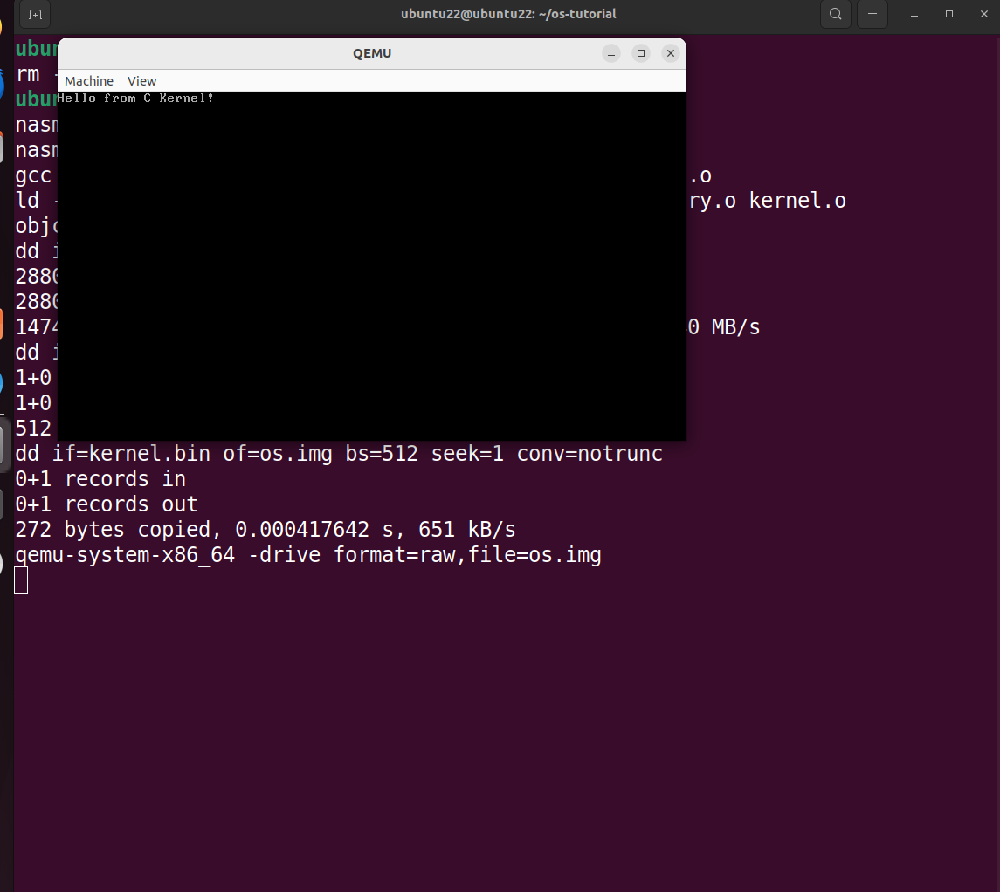

# 从零开始制作 MyOS（四）—— 跳转到 C 语言编写的小型内核

## 目标

在引导加载器准备好后，用 C 语言编写一个小型内核并实现从引导加载器跳转到内核执行。

## 代码

### 引导程序文件

```boot.asm
org 0x7C00
bits 16

start:
    ; 初始化段寄存器
    xor ax, ax
    mov ds, ax
    mov es, ax
    mov ss, ax
    mov sp, 0x7C00

    ; 显示启动信息
    mov si, msg_loading
    call print_string

    ; 加载内核到 0x10000
    mov ax, 0x1000
    mov es, ax
    xor bx, bx
    
    mov ah, 0x02    ; 读扇区
    mov al, 4       ; 4个扇区
    mov ch, 0       ; 柱面0
    mov cl, 2       ; 扇区2
    mov dh, 0       ; 磁头0
    mov dl, 0x80    ; 驱动器
    int 0x13
    jc disk_error

    ; 切换到保护模式
    cli
    lgdt [gdt_descriptor]
    
    ; 启用A20
    in al, 0x92
    or al, 2
    out 0x92, al
    
    mov eax, cr0
    or eax, 1
    mov cr0, eax
    
    jmp CODE_SEG:init_pm

disk_error:
    mov si, msg_error
    call print_string
    jmp $

print_string:
    lodsb
    test al, al
    jz .done
    mov ah, 0x0E
    int 0x10
    jmp print_string
.done:
    ret

bits 32
init_pm:
    mov ax, DATA_SEG
    mov ds, ax
    mov es, ax
    mov ss, ax
    mov esp, 0x90000
    
    ; 跳转到内核
    jmp 0x10000

; 数据区
msg_loading db "Booting...", 0xD, 0xA, 0
msg_error db "Disk error!", 0

; GDT
gdt_start:
    dq 0
gdt_code:
    dw 0xFFFF
    dw 0
    db 0
    db 10011010b
    db 11001111b
    db 0
gdt_data:
    dw 0xFFFF
    dw 0
    db 0
    db 10010010b
    db 11001111b
    db 0
gdt_end:

gdt_descriptor:
    dw gdt_end - gdt_start - 1
    dd gdt_start

CODE_SEG equ gdt_code - gdt_start
DATA_SEG equ gdt_data - gdt_start

times 510-($-$$) db 0
dw 0xAA55

```

### 内核入口文件

```entry.asm
section .text
global _start

_start:
    mov esp, 0x90000  ; 设置栈指针
    extern kernel_main
    call kernel_main   ; 调用C内核
    hlt
```

小型内核文件

```kernel.c
void kernel_main(void) {
    char *vga = (char*)0xB8000;
    
    // 清屏
    for (int i = 0; i < 80 * 25 * 2; i += 2) {
        vga[i] = ' ';
        vga[i + 1] = 0x07;
    }
    
    // 显示字符串
    char *msg = "Hello from C Kernel!";
    for (int i = 0; msg[i]; i++) {
        vga[i * 2] = msg[i];
        vga[i * 2 + 1] = 0x07;
    }
    
    while(1) asm("hlt");
}
```

### 链接器

```linker.ld
ENTRY(_start)

SECTIONS
{
    . = 0x10000;
    
    .text : { *(.text) }
    .data : { *(.data) }
    .bss : { *(.bss) }
}
```

### Makefile

```Makefile
CC = gcc
LD = ld
ASM = nasm

CFLAGS = -m32 -ffreestanding -nostdlib -c
ASFLAGS = -f elf32
LDFLAGS = -m elf_i386 -T linker.ld -nostdlib

all: os.img

os.img: boot.bin kernel.bin
	dd if=/dev/zero of=os.img bs=512 count=2880
	dd if=boot.bin of=os.img conv=notrunc
	dd if=kernel.bin of=os.img bs=512 seek=1 conv=notrunc

boot.bin: boot.asm
	$(ASM) -f bin boot.asm -o boot.bin

kernel.bin: kernel.elf
	objcopy -O binary kernel.elf kernel.bin

kernel.elf: entry.o kernel.o
	$(LD) $(LDFLAGS) -o kernel.elf entry.o kernel.o

kernel.o: kernel.c
	$(CC) $(CFLAGS) kernel.c -o kernel.o

entry.o: entry.asm
	$(ASM) $(ASFLAGS) entry.asm -o entry.o

clean:
	rm -f *.o *.bin *.elf os.img

run: os.img
	qemu-system-x86_64 -drive format=raw,file=os.img

.PHONY: all clean run
```

### 编译运行

```bash
# ubuntu 中，VGA 显示
make clean && make run

```

### 运行结果

当终端打印出来“Hello from C Kernel!”，就表示运行成功了



## 问题

本节遇到最大的问题是内核跳转不过来，目前只找到以下一些可能：

### 磁盘问题

1. 段寄存器设置顺序错误
    + 先设置ES再操作磁盘

2. 缺少错误重试机制​
    + 

3. 扇区数不足

### A20地址线启用问题

1. and al, 0xFE会错误清除bit 0（可能影响系统重启）

2. 缺少状态检查​：未验证A20是否真正启用成功

### 保护模式跳转问题

1. 无效跳转指令，jmp 0x10000未使用段选择子，在保护模式下会崩溃
2. 缺少段寄存器初始化​：未正确设置DS/ES/SS等数据段寄存器

### 内核入口对齐问题

1. 未声明全局符号​：_start未在entry.asm中声明为global
2. ​栈未对齐​：x86要求栈指针按16字节对齐

### 编译链接问题

1. 缺少内核地址指定​：链接脚本未强制指定内核加载地址为0x10000
2. 未处理BSS段​：未清零未初始化数据段
