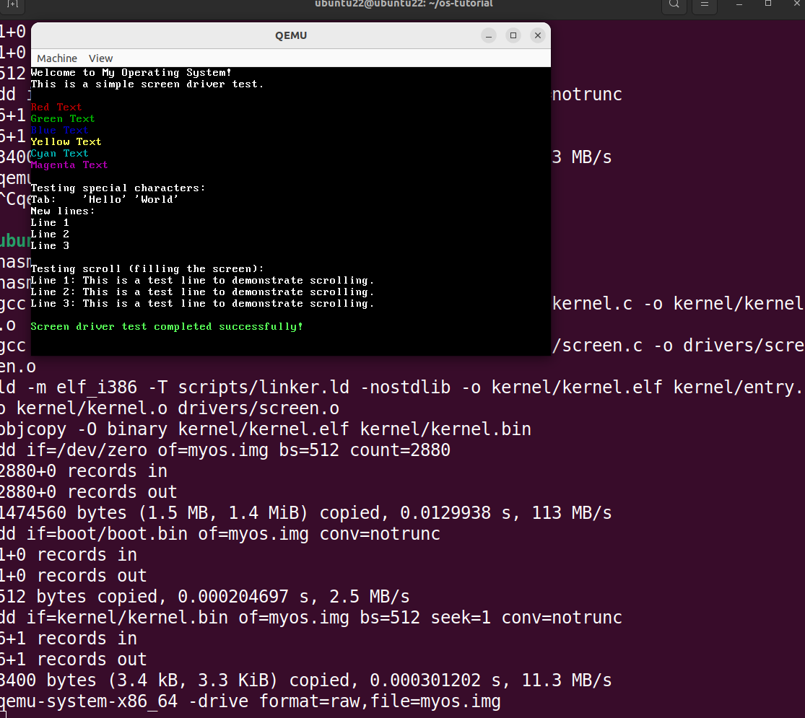

# 从零开始制作 MyOS（五）

## 归类项目文件

### 移动源码

将源码归类到各个文件夹中，修改 Makefile

├── boot
│   └── boot.asm
├── drivers
├── kernel
│   ├── entry.asm
│   └── kernel.c
├── libs
├── Makefile
└── scripts
    └── linker.ld

新增 boot，drivers，kernel，libs，scripts 文件夹，将对应的源文件如上归类

### Makefile 修改

```
CC = gcc
LD = ld
ASM = nasm
QEMU = qemu-system-x86_64

CFLAGS = -m32 -ffreestanding -nostdlib -c
ASFLAGS = -f elf32
LDFLAGS = -m elf_i386 -T scripts/linker.ld -nostdlib

OS_IMAGE = myos.img
BOOT_BIN = boot/boot.bin
BOOT_SRC = boot/boot.asm

KERNEL_ENTRY_SRC = kernel/entry.asm
KERNEL_ENTRY_OBJ = kernel/entry.o

KERNEL_C_SRC = kernel/kernel.c
KERNEL_C_OBJ = kernel/kernel.o

SCREEN_C_SRC = drivers/screen.c
SCREEN_C_OBJ = drivers/screen.o

KERNEL_BIN = kernel/kernel.bin

all: $(OS_IMAGE)

$(OS_IMAGE): $(BOOT_BIN) $(KERNEL_BIN)
	dd if=/dev/zero of=$(OS_IMAGE) bs=512 count=2880
	dd if=$(BOOT_BIN) of=$(OS_IMAGE) conv=notrunc
	dd if=$(KERNEL_BIN) of=$(OS_IMAGE) bs=512 seek=1 conv=notrunc

$(BOOT_BIN): $(BOOT_SRC)
	$(ASM) -f bin $(BOOT_SRC) -o $(BOOT_BIN)

$(KERNEL_BIN): kernel/kernel.elf
	objcopy -O binary kernel/kernel.elf $(KERNEL_BIN)

kernel/kernel.elf: $(KERNEL_ENTRY_OBJ) $(KERNEL_C_OBJ)
	$(LD) $(LDFLAGS) -o kernel/kernel.elf $(KERNEL_ENTRY_OBJ) $(KERNEL_C_OBJ)

$(KERNEL_C_OBJ): $(KERNEL_C_SRC)
	$(CC) $(CFLAGS) $(KERNEL_C_SRC) -o $(KERNEL_C_OBJ)

$(KERNEL_ENTRY_OBJ): $(KERNEL_ENTRY_SRC)
	$(ASM) $(ASFLAGS) $(KERNEL_ENTRY_SRC) -o $(KERNEL_ENTRY_OBJ)

clean:
	rm -f *.o *.bin *.elf $(OS_IMAGE) $(BOOT_BIN) kernel/kernel.elf $(KERNEL_BIN) $(KERNEL_ENTRY_OBJ) $(KERNEL_C_OBJ) $(SCREEN_C_OBJ)

run: $(OS_IMAGE)
	$(QEMU) -drive format=raw,file=$(OS_IMAGE)

.PHONY: all clean run
```

然后编译运行看是否能正确打印 kernel.c 中的日志

### 问题：

+ 修改了 Makefile 编译报错
+ 必须要加一个 elf 中间编译文件，不然保护模式切换不到 kernel.c 内核中去

## 实现屏幕驱动

在 drivers 目录下添加一个 screen.h 和 screen.c 文件

### screen.h

```screen.h
#ifndef SCREEN_H
#define SCREEN_H

#include <stdint.h>

/* 屏幕颜色枚举 */
typedef enum {
    BLACK = 0,
    BLUE = 1,
    GREEN = 2,
    CYAN = 3,
    RED = 4,
    MAGENTA = 5,
    BROWN = 6,
    LIGHT_GRAY = 7,
    DARK_GRAY = 8,
    LIGHT_BLUE = 9,
    LIGHT_GREEN = 10,
    LIGHT_CYAN = 11,
    LIGHT_RED = 12,
    LIGHT_MAGENTA = 13,
    YELLOW = 14,
    WHITE = 15
} vga_color;

// extern void outb(uint16_t port, uint8_t value);

/* 端口输出函数 */
static inline void outb(uint16_t port, uint8_t value) {
    asm volatile ("outb %0, %1" : : "a"(value), "Nd"(port));
}

/* 组合颜色字节 */
static inline uint8_t make_color(vga_color fg, vga_color bg) {
    return fg | (bg << 4);
}

/* 组合字符和颜色 */
static inline uint16_t make_vga_entry(char c, uint8_t color) {
    return (uint16_t)c | ((uint16_t)color << 8);
}

/* 函数声明 */
void clear_screen(void);
void put_char(char c, uint8_t color);
void printk(const char* str);
void printf(const char* format, ...);
void printk_color(const char* str, uint8_t color);
void set_cursor_pos(uint8_t x, uint8_t y);
uint16_t get_cursor_pos(void);

#endif
```

### screen.c

```screen.c
#include "screen.h"
#include <stdarg.h>

/* VGA 文本模式内存地址 */
#define VIDEO_MEMORY 0xB8000

/* 屏幕尺寸 */
#define SCREEN_WIDTH 80
#define SCREEN_HEIGHT 25

/* 当前光标位置 */
static uint16_t cursor_x = 0;
static uint16_t cursor_y = 0;

/* 清屏函数 */
void clear_screen(void) {
    uint16_t* video_mem = (uint16_t*)VIDEO_MEMORY;
    uint8_t color = make_color(WHITE, BLACK);
    uint16_t blank = make_vga_entry(' ', color);
    
    for (int i = 0; i < SCREEN_WIDTH * SCREEN_HEIGHT; i++) {
        video_mem[i] = blank;
    }
    
    cursor_x = 0;
    cursor_y = 0;
    set_cursor_pos(0, 0);
}

/* 更新硬件光标位置 */
void set_cursor_pos(uint8_t x, uint8_t y) {
    uint16_t pos = y * SCREEN_WIDTH + x;
    
    /* 向 VGA 控制寄存器发送命令 */
    outb(0x3D4, 0x0F);
    outb(0x3D5, (uint8_t)(pos & 0xFF));
    outb(0x3D4, 0x0E);
    outb(0x3D5, (uint8_t)((pos >> 8) & 0xFF));
    
    cursor_x = x;
    cursor_y = y;
}

/* 获取当前光标位置 */
uint16_t get_cursor_pos(void) {
    return cursor_y * SCREEN_WIDTH + cursor_x;
}

/* 滚屏 */
static void scroll(void) {
    uint16_t* video_mem = (uint16_t*)VIDEO_MEMORY;
    uint8_t color = make_color(WHITE, BLACK);
    uint16_t blank = make_vga_entry(' ', color);
    
    /* 将第2行到最后一行向上移动一行 */
    for (int i = 0; i < (SCREEN_HEIGHT - 1) * SCREEN_WIDTH; i++) {
        video_mem[i] = video_mem[i + SCREEN_WIDTH];
    }
    
    /* 清空最后一行 */
    for (int i = (SCREEN_HEIGHT - 1) * SCREEN_WIDTH; i < SCREEN_HEIGHT * SCREEN_WIDTH; i++) {
        video_mem[i] = blank;
    }
    
    cursor_y = SCREEN_HEIGHT - 1;
}

/* 输出单个字符 */
void put_char(char c, uint8_t color) {
    uint16_t* video_mem = (uint16_t*)VIDEO_MEMORY;
    
    /* 处理换行符 */
    if (c == '\n') {
        cursor_x = 0;
        cursor_y++;
    } 
    /* 处理回车符 */
    else if (c == '\r') {
        cursor_x = 0;
    }
    /* 处理制表符 */
    else if (c == '\t') {
        cursor_x = (cursor_x + 4) & ~(4 - 1);
    }
    /* 处理普通字符 */
    else {
        uint16_t index = cursor_y * SCREEN_WIDTH + cursor_x;
        video_mem[index] = make_vga_entry(c, color);
        cursor_x++;
    }
    
    /* 检查是否需要换行或滚屏 */
    if (cursor_x >= SCREEN_WIDTH) {
        cursor_x = 0;
        cursor_y++;
    }
    
    if (cursor_y >= SCREEN_HEIGHT) {
        scroll();
    }
    
    /* 更新光标位置 */
    set_cursor_pos(cursor_x, cursor_y);
}

/* 输出字符串（默认颜色） */
void printk(const char* str) {
    printk_color(str, make_color(WHITE, BLACK));
}

/* 输出字符串（指定颜色） */
void printk_color(const char* str, uint8_t color) {
    while (*str) {
        put_char(*str++, color);
    }
}

/* 整数转字符串 */
static void itoa(int value, char* str, int base) {
    char* ptr = str;
    char* ptr1 = str;
    char tmp_char;
    int tmp_value;
    
    // 处理0
    if (value == 0) {
        *ptr++ = '0';
        *ptr = '\0';
        return;
    }
    
    // 转换数字
    while (value) {
        tmp_value = value;
        value /= base;
        *ptr++ = "zyxwvutsrqponmlkjihgfedcba9876543210123456789abcdefghijklmnopqrstuvwxyz"[35 + (tmp_value - value * base)];
    }
    
    *ptr-- = '\0';
    
    // 反转字符串
    while (ptr1 < ptr) {
        tmp_char = *ptr;
        *ptr-- = *ptr1;
        *ptr1++ = tmp_char;
    }
}

/* 支持格式化的输出函数 */
void printf(const char* format, ...) {
    va_list args;
    va_start(args, format);
    
    char buffer[32];
    
    while (*format) {
        if (*format == '%') {
            format++;
            switch (*format) {
                case 'd': {
                    int num = va_arg(args, int);
                    itoa(num, buffer, 10);
                    printk(buffer);
                    break;
                }
                case 's': {
                    char* str = va_arg(args, char*);
                    printk(str);
                    break;
                }
                case 'c': {
                    char c = (char)va_arg(args, int);
                    put_char(c, make_color(WHITE, BLACK));
                    break;
                }
                case 'x': {
                    int num = va_arg(args, int);
                    itoa(num, buffer, 16);
                    printk(buffer);
                    break;
                }
                default:
                    put_char(*format, make_color(WHITE, BLACK));
                    break;
            }
        } else {
            put_char(*format, make_color(WHITE, BLACK));
        }
        format++;
    }
    
    va_end(args);
}
```

### Makefile

修改对应的 Makefile

```Makefile
CC = gcc
LD = ld
ASM = nasm
QEMU = qemu-system-x86_64

INCLUDES = -I drivers

CFLAGS = -m32 -ffreestanding -nostdlib -c $(INCLUDES)
ASFLAGS = -f elf32
LDFLAGS = -m elf_i386 -T scripts/linker.ld -nostdlib

OS_IMAGE = myos.img
BOOT_BIN = boot/boot.bin
BOOT_SRC = boot/boot.asm

KERNEL_ENTRY_SRC = kernel/entry.asm
KERNEL_ENTRY_OBJ = kernel/entry.o

KERNEL_C_SRC = kernel/kernel.c
KERNEL_C_OBJ = kernel/kernel.o

SCREEN_H = drivers/screen.h
SCREEN_C_SRC = drivers/screen.c
SCREEN_C_OBJ = drivers/screen.o

KERNEL_BIN = kernel/kernel.bin
KERNEL_ELF = kernel/kernel.elf

all: $(OS_IMAGE)

$(OS_IMAGE): $(BOOT_BIN) $(KERNEL_BIN)
	dd if=/dev/zero of=$(OS_IMAGE) bs=512 count=2880
	dd if=$(BOOT_BIN) of=$(OS_IMAGE) conv=notrunc
	dd if=$(KERNEL_BIN) of=$(OS_IMAGE) bs=512 seek=1 conv=notrunc

$(BOOT_BIN): $(BOOT_SRC)
	$(ASM) -f bin $(BOOT_SRC) -o $(BOOT_BIN)

$(KERNEL_BIN): $(KERNEL_ELF)
	objcopy -O binary $(KERNEL_ELF) $(KERNEL_BIN)

$(KERNEL_ELF): $(KERNEL_ENTRY_OBJ) $(KERNEL_C_OBJ) $(SCREEN_C_OBJ)
	$(LD) $(LDFLAGS) -o $(KERNEL_ELF) $(KERNEL_ENTRY_OBJ) $(KERNEL_C_OBJ) $(SCREEN_C_OBJ)

$(KERNEL_C_OBJ): $(KERNEL_C_SRC) $(SCREEN_H)
	$(CC) $(CFLAGS) $(KERNEL_C_SRC) -o $(KERNEL_C_OBJ)

$(SCREEN_C_OBJ): $(SCREEN_C_SRC) $(SCREEN_H)
	$(CC) $(CFLAGS) $(SCREEN_C_SRC) -o $(SCREEN_C_OBJ)

$(KERNEL_ENTRY_OBJ): $(KERNEL_ENTRY_SRC)
	$(ASM) $(ASFLAGS) $(KERNEL_ENTRY_SRC) -o $(KERNEL_ENTRY_OBJ)

clean:
	rm -f  $(OS_IMAGE) $(BOOT_BIN) $(KERNEL_ELF) $(KERNEL_BIN) $(KERNEL_ENTRY_OBJ) $(KERNEL_C_OBJ) $(SCREEN_C_OBJ)

run: $(OS_IMAGE)
	$(QEMU) -drive format=raw,file=$(OS_IMAGE)

.PHONY: all clean run
```

### 编译运行

```bash
make clean

make run
```

### 运行结果



## 问题

+ 添加 screen 驱动代码时 kernel.c 日志打印不出来
+ boot.asm 给的扇区空间太小，修改 boot.asm 扇区大小

```boot.asm

mov al, 4       ; 只读4个扇区（2KB）
```

### 内存空间分配策略
太好了！问题找到了。让我分析一下空间分配的问题和后续开发建议。

## 当前空间使用分析

### 你原来的设置：
```nasm
mov al, 4       ; 4个扇区 = 4 × 512字节 = 2KB
```

### 实际需要的空间：
- **boot.bin**: 512字节 (1扇区)
- **entry.asm**: ~100-200字节
- **kernel.c + screen.c**: 随着功能增加会快速增长
- **未来模块**: 内存管理、中断处理、文件系统等

## 空间分配策略

### 阶段1：基础开发（当前）
```nasm
mov al, 16      ; 16个扇区 = 8KB
```
**分配**：
- entry.asm: 0.5KB
- kernel.c: 2-3KB  
- screen.c: 1-2KB
- 其他驱动: 2-3KB
- **剩余**: 1-2KB缓冲

### 阶段2：中等规模开发
```nasm
mov al, 32      ; 32个扇区 = 16KB
```
**分配**：
- 基础内核: 6-8KB
- 内存管理: 3-4KB
- 中断处理: 2-3KB
- 进程管理: 3-4KB
- **剩余**: 1-2KB缓冲

### 阶段3：完整系统
```nasm
mov al, 64      ; 64个扇区 = 32KB
```
或者考虑二级引导加载器

## 实用的空间管理方案

### 方案A：固定大空间（推荐）
```nasm
; 在boot.asm中直接分配充足空间
mov al, 32      ; 32扇区 = 16KB，足够前期开发
```

### 方案B：动态检测（高级）
```nasm
; 读取内核大小信息（需要在内核开头存储大小）
mov al, [kernel_size_sectors]  ; 从内核元数据读取
```

## 链接器脚本优化

确保链接器脚本正确设置内核布局：

**scripts/linker.ld**：
```ld
ENTRY(_start)

SECTIONS
{
    . = 0x10000;    /* 内核加载地址 */
    
    .text : {
        *(.text)
    }
    
    .data : {
        *(.data)
    }
    
    .bss : {
        *(.bss)
    }
    
    /* 内核大小信息，可用于引导程序检测 */
    kernel_end = .;
}
```

## 开发阶段建议

### 阶段1：核心功能（8KB足够）
- [x] 引导加载器
- [x] 屏幕驱动  
- [ ] 格式化输出
- [ ] 中断描述符表
- [ ] 键盘输入

### 阶段2：系统服务（16KB）
- [ ] 物理内存管理
- [ ] 虚拟内存管理
- [ ] 进程调度
- [ ] 系统调用

### 阶段3：高级功能（32KB+）
- [ ] 文件系统
- [ ] 用户模式
- [ ] 网络协议栈
- [ ] 设备驱动

## 实用的Makefile改进

添加大小检查：

```makefile
# 在Makefile中添加内核大小检查
KERNEL_SIZE = $(shell stat -c%s $(KERNEL_BIN) 2>/dev/null || stat -f%z $(KERNEL_BIN))
KERNEL_SECTORS = $(shell echo $$(( ($(KERNEL_SIZE) + 511) / 512 )))

size-check: $(KERNEL_BIN)
	@echo "Kernel size: $(KERNEL_SIZE) bytes ($(KERNEL_SECTORS) sectors)"
	@if [ $(KERNEL_SECTORS) -gt 32 ]; then \
		echo "WARNING: Kernel too large!"; \
	fi
```

## 立即行动建议

1. **修改boot.asm**：
   ```nasm
   mov al, 32      ; 32扇区 = 16KB
   ```

2. **添加大小监控**：
   ```bash
   make size-check  # 检查内核大小
   ```

3. **设置安全阈值**：
   - 警告阈值：28扇区 (14KB)
   - 错误阈值：32扇区 (16KB)

## 长期解决方案

当内核超过64KB时，考虑：
1. **二级引导加载器**
2. **内核压缩**
3. **模块化加载**
