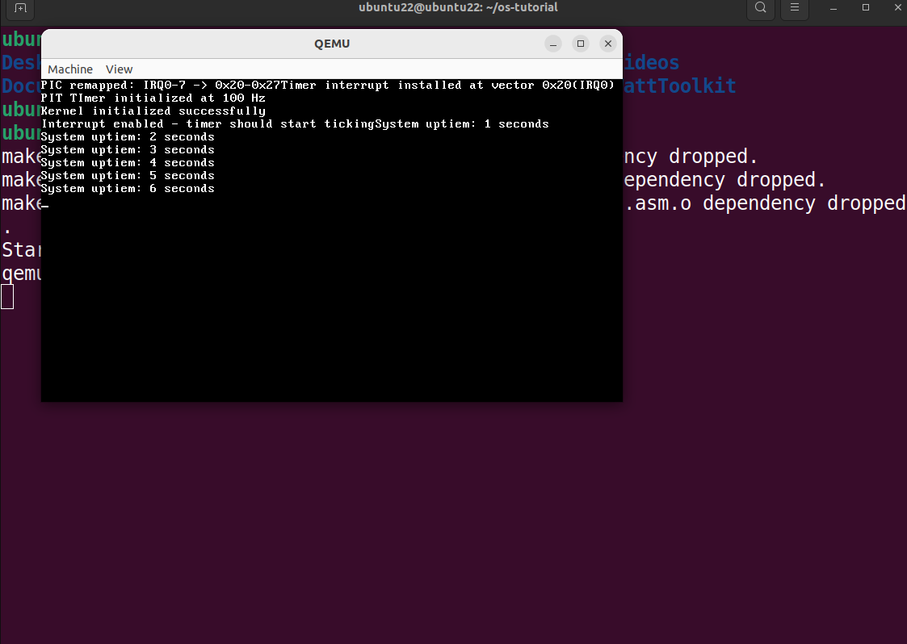

# 从零开始制作 MyOS（六）—— 定时器中断

## 引言

本节的任务是添加定时器中断

## 背景知识

1. 中断向量是什么
+ 从软件层面上来说是一个数字标号，用来记录某个中断的事件的。
+ 从硬件层面上来说，中断向量是数据总线上的8位电信号编码

2. 以键盘输入为例介绍中断触发过程
    + 键盘上按下 'A' 键后，键盘控制器发送 IRQ1 信号
    + PIC 编程控制器将 IRQ1 信号转化成向量 33
    + CPU 查 IDT[33], 找到 keyboard_hanlder
    + 跳转到键盘处理函数
    + 读取扫描码，转化为字符 'A'

3. 中断向量冲突解释
    + 向量冲突源于早期PC架构的历史遗留：
    + Intel 8259A PIC 芯片设计时默认使用向量0-7处理硬件中断
    + 8086 CPU设计小组则保留向量0-31处理内部异常。
    + 当IBM在1981年组装PC时，这个冲突显现出来——硬件发送向量0表示定时器中断，CPU却误认为是除零异常。解决方案是通过PIC重映射，将硬件中断向量移到32-47的安全区域。

4. 硬件和CPU视角内部细节
    + 硬件内部通常都会有一个专用芯片，用来处理硬件上触发的事件，这个专用芯片只会处理特定事件：
        - 定时器芯片: 只会计数
        - 键盘控制器芯片: 只会读键盘矩阵  
        - 显卡芯片: 只会画像素
        - 声卡芯片: 只会处理音频信号
    + CPU 本质也是一个芯片，但是它是一个通用芯片，能处理各种复杂决策。它负责处理硬件发送过来的事件。

## 编程中断控制器

PIC，也就是编程中断控制， 是一个专门的硬件芯片，负责管理和协调多个硬件设备的中断请求，然后有秩序地通知CPU。

### 物理结构

                    +---------------+
硬件设备1 (键盘) ---->|               |
硬件设备2 (定时器) -->|   8259A PIC   |-----> CPU的INTR引脚
硬件设备3 (鼠标) ---->|               |
                    +---------------+

### IRQ线路分配

#### 主PIC (端口 0x20-0x21)

``` text
IRQ0  - 系统定时器 (PIT)
IRQ1  - 键盘
IRQ2  - 用于连接从PIC
IRQ3  - COM2串口
IRQ4  - COM1串口
IRQ5  - LPT2并行口
IRQ6  - 软盘控制器
IRQ7  - LPT1并行口
```

#### 从PIC (端口 0xA0-0xA1)

```text
IRQ8  - 实时时钟 (RTC)
IRQ9  - 重定向到IRQ2
IRQ10 - 保留
IRQ11 - 保留  
IRQ12 - PS/2鼠标
IRQ13 - 数学协处理器
IRQ14 - 主硬盘控制器
IRQ15 - 从硬盘控制器
```

### PIC 解决向量冲突细节：

先解释一下这个向量的含义：

向量本质是软件层面对物理硬件中引脚高低信号拉高拉低的抽象处理：
```
// 物理世界的电信号
物理层:   设备引脚电压变化 → PIC编码 → 数据总线电信号
          [高电平/低电平]   →   [8位二进制]  →  [CPU读取]

// 举例：定时器中断
PIT芯片:   IRQ0引脚拉高 → PIC编码为00100000 → CPU读取为32
```

所以硬件和CPU本质都公用这一套物理层的高低引脚，换句话说，它们都公用这一套向量表，而这一套向量表被整理成中断标识符表，用来表明各个硬件上的事件发生。

这就是 CPU 和硬件发生向量冲突的底层逻辑。

Intel在设计x86 CPU时，保留了前32个中断向量（0-31）用于：

```text
0-31: CPU内部异常和特殊功能
  0 - 除零错误
  1 - 调试异常
  2 - 不可屏蔽中断(NMI)
  3 - 断点
  4 - 溢出
  5 - 边界检查
  6 - 无效操作码
  7 - 设备不可用
  8 - 双重故障
  9 - 协处理器段溢出
 10 - 无效TSS
 11 - 段不存在
 12 - 栈段故障
 13 - 通用保护故障
 14 - 页故障
 15 - 保留
 16 - 浮点错误
 17 - 对齐检查
 18 - 机器检查
 19-31 - 保留给未来CPU特性
```

而硬件厂商（IBM）在设计 original PC 时，选择 8259A 芯片时，这个芯片默认使用向量 0-7

```
IRQ0 - 向量0 (定时器)
IRQ1 - 向量1 (键盘) 
IRQ2 - 向量2 (级联)
IRQ3 - 向量3 (COM2)
IRQ4 - 向量4 (COM1)
IRQ5 - 向量5 (LPT2)
IRQ6 - 向量6 (软盘)
IRQ7 - 向量7 (LPT1)
```

于是，两者就发生了冲突了，也就是，来一个向量 0， CPU 视角和硬件视角下理解是不一样的，于是就采用了 PIC 编程将后者做了映射：

```text
IRQ0 (定时器)  -> 中断向量 32
IRQ1 (键盘)   -> 中断向量 33
...
IRQ7         -> 中断向量 39
IRQ8         -> 中断向量 40
...
IRQ15        -> 中断向量 47
```

### PIC 工作流程

```text
1. 硬件设备触发中断 → PIC接收
2. PIC检查优先级 → 选择最高优先级的IRQ
3. PIC向CPU发送INT信号 + 向量号
4. CPU保存状态，跳转到IDT中对应的处理程序
5. 处理程序执行完毕 → 发送EOI给PIC
6. PIC允许下一个中断
```

## 代码

### drivers/timer.h

```
#ifndef TIMER_H
#define TIMER_H

#include "../kernel/types.h"  // 包含uint32_t等类型定义

/* 硬件端口定义 */
#define PIT_CHANNEL0_PORT 0x40  // PIT通道0数据端口
#define PIT_COMMAND_PORT  0x43  // PIT命令端口
#define TIMER_FREQUENCY 100     // 目标频率：100Hz = 每10ms一次中断

/* 函数声明 */
void init_timer(void);           // 初始化硬件定时器
uint32_t get_ticks(void);        // 获取系统滴答数
void timer_interrupt_handler(void); // 定时器中断处理函数

#endif
```

### drivers/timer.c

```
#include "timer.h"
#include "screen.h"      // 使用现有的printf和outb函数

/* 全局变量 - 记录系统运行时间 */
volatile uint32_t system_ticks = 0;  
// volatile告诉编译器这个变量可能被异步修改，不要优化

/* 初始化可编程间隔定时器(PIT) */
void init_timer(void) {
    // 计算分频器值: 基础频率1193180Hz / 目标频率100Hz
    uint32_t divisor = 1193180 / TIMER_FREQUENCY;
    
    // 发送命令字节到PIT命令端口: 0x36 = 00110110b
    // 00=通道0, 11=先低后高字节, 011=模式3(方波), 0=16位二进制
    outb(PIT_COMMAND_PORT, 0x36);
    
    // 发送分频器值 (先低字节，后高字节)
    outb(PIT_CHANNEL0_PORT, (uint8_t)(divisor & 0xFF));        // 低8位
    outb(PIT_CHANNEL0_PORT, (uint8_t)((divisor >> 8) & 0xFF)); // 高8位
    
    printf("PIT Timer initialized at %d Hz\n", TIMER_FREQUENCY);
}

/* 定时器中断处理程序 - 每次定时器中断时自动调用 */
void timer_interrupt_handler(void) {
    system_ticks++;  // 增加滴答计数
    
    // 每秒打印一次调试信息 (因为频率是100Hz，100次滴答=1秒)
    if (system_ticks % TIMER_FREQUENCY == 0) {
        printf("System uptime: %d seconds\n", system_ticks / TIMER_FREQUENCY);
    }
    
    // 必须向PIC发送中断结束(EOI)信号，否则不会再收到中断！
    outb(0x20, 0x20);  // 0x20是主PIC命令端口，0x20是EOI命令
}

/* 获取系统启动以来的滴答数 */
uint32_t get_ticks(void) {
    return system_ticks;
}
```

### kernel/interrupt.h

```

// 新增函数声明：
void init_pic(void);                    // 初始化8259A PIC芯片
void install_timer_interrupt(void);     // 安装定时器中断处理程序
extern void isr32(void);                // 新增：定时器中断的汇编入口
```

### kernel/interrupt.c

```
#include "timer.h"  // 新增：包含定时器驱动头文件

/* 初始化8259A可编程中断控制器 */
void init_pic(void) {
    // 重新映射PIC中断向量
    // 原因：x86默认PIC映射到0-15，与CPU异常冲突，需要重映射到32-47
    
    outb(0x20, 0x11);  // 主PIC初始化命令
    outb(0xA0, 0x11);  // 从PIC初始化命令
    
    outb(0x21, 0x20);  // 主PIC起始中断向量: 0x20 (32)
    outb(0xA1, 0x28);  // 从PIC起始中断向量: 0x28 (40)
    
    outb(0x21, 0x04);  // 告诉主PIC有从PIC在IRQ2
    outb(0xA1, 0x02);  // 告诉从PIC它的级联身份
    
    outb(0x21, 0x01);  // 8086模式
    outb(0xA1, 0x01);
    
    // 屏蔽所有中断，除了定时器(IRQ0)
    outb(0x21, 0xFE);  // 0xFE = 11111110b - 只允许IRQ0
    outb(0xA1, 0xFF);  // 0xFF = 11111111b - 屏蔽所有从PIC中断
    
    printf("PIC remapped: IRQ0-7 -> 0x20-0x27\n");
}

/* 安装定时器中断处理程序 */
void install_timer_interrupt(void) {
    // 将IRQ0(定时器)映射到中断向量32
    idt_set_gate(32, (uint32_t)isr32, 0x08, 0x8E);
    printf("Timer interrupt installed at vector 0x20 (IRQ0)\n");
}
```

### kerenel/interrupt.asm

```
; 新增外部引用
extern timer_interrupt_handler          ; 引用C语言的定时器处理函数

; 新增全局符号
global isr32              ; 导出定时器中断入口

; 在原有宏定义后新增：
ISR_NOERRCODE 32   ; 新增：定时器中断 (IRQ0映射到向量32)

; 在isr_common分发逻辑中新增：
cmp eax, 32
je .call_timer        ; 如果是中断32，跳转到定时器处理

.call_timer:
    ; 定时器中断不需要传递栈帧，直接调用
    call timer_interrupt_handler  ; 调用C处理函数
    jmp .done
```

### 运行结果



如图所示：看到每1s循环打印 "System uptime" 一行日志输出就说明定时器中断添加成功


